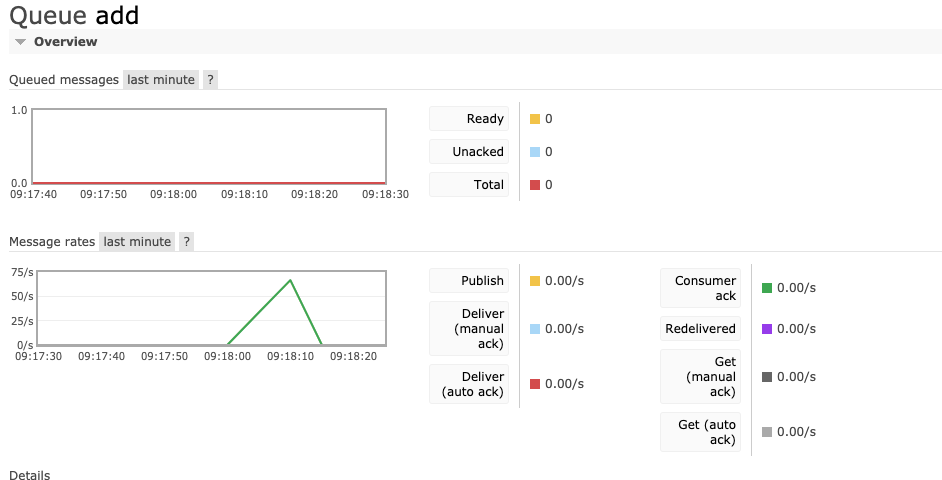
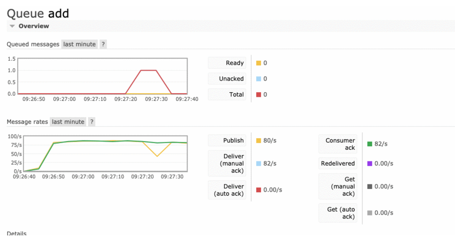
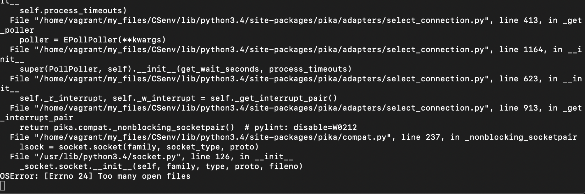

# Rendimiento - Servidor de suma RabbitMQ

Incialmente se analizaron 500 clientes conectados simultaneamente (ejecutados desde el mismo computador). Con un **sleep** de 30 segundos en la funcion de callback del servidor. El resultado se puede apreciar en la siguiente imagen:

Notamos qué resolvió todas y cada una de las operaciones en **10 segundos** exactamente.

Para aumentar la complejidad del ejercicio se decidio aumentar el numero de clientes conectados simulaneamente a **1000** y **quitandole el sleep** de 30 segundos que se habia mostrado previamente. El resultado fue el siguiente:

En este punto del ejercicio empezamos a notar qué el numero de Publish y Consumer ack es decir, el numero de recibimiento y respuesta se limita en **80 a 82** por segundo. Asi qué; Por qué no ponerle el timer nuevamente y ejecutarlo con un numero desproporcionado de hilos y ver como se van enlistando en la cola? (4000 hilos)

El resultado fue el siguiente:

Exacto !; Se pusieron en cola 250 peticiones de los clientes; pero por temas de hardware y de otorgamiento de recursos de red del sistema operativo limitó la creación de más sockets. Aqui va otro hallazgo: **RabbitMQ a bajo nivel usa sockets para el paso de mensajes**.

Y además de esto encontramos qué nuestro servidor no estaba ejecutando las peticiones de forma paralela; por lo tanto logró encolar 250 peticiones (las qué le permitió el SO al proceso) y empezo a resolver una a una cada 30 segundos. Pero, si resuelve operaciones tan rapidamente, como será el rendimiento para 1.000.000 de clientes sin timer y sin ser paralelo el servidor?

Pues el resultado fue el siguiente:

Siguio respondiendo un promedio de más o menos 80-87 peticiones por segundo a medida qué iba recibiendo la misma cantidad. Poniento en cola muy pocas peticiones (el máximo en cola fueron 2).

### Conclusiones Generales

* El servidor sin un timer qué interrumpa el proceso atiende entre 79 a 87 clientes por segundos.
* La librería RabbitMQ por si sola (y por lo qué se trató de investigar) no posee de forma nativa una forma de implementar el paralelismo; Solo posee una funcion denominada **basic_qos** qué nos permite limitar el numero de consumers o de channels pero realmente lo qué hace ese limitarlos entre ellos (consumers o channels). Es decir, entre ellos solo podrán realizarse las conexiones qué determinemos; pero al ser nuestra arquitectura C/S todas las peticiones irán centralizadas al servidor.
* Sin el limitante de sockets por el SO operativo; es decir, teniendo clientes reales realmente distribuidos RabbitMQ tiene un rendimiento bastante optimo demostrando ser capaz de soportar más de las 100 o 200 peticiones por segundo.
* La forma de encolar los mensajes es muy interesante, puesto qué apesar de que el servidor caiga al momento de ser levantado él retoma las operaciones en cola incluso despúes de la interrupción del servicio.